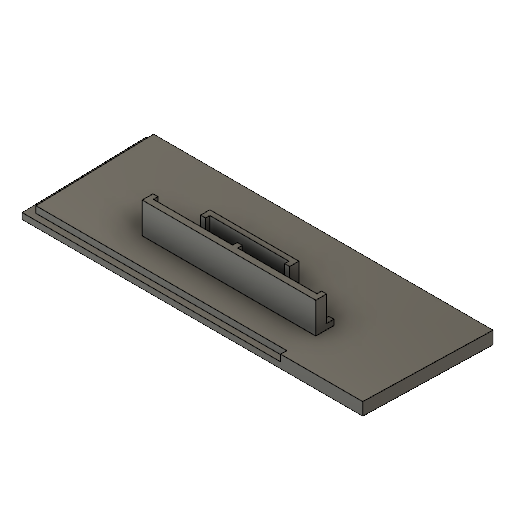
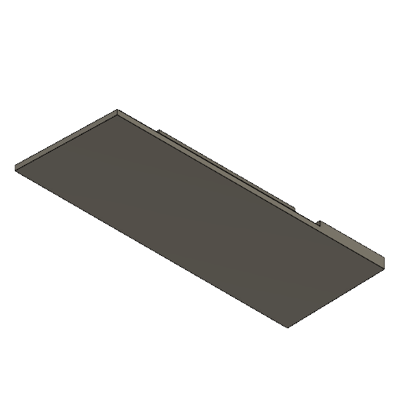
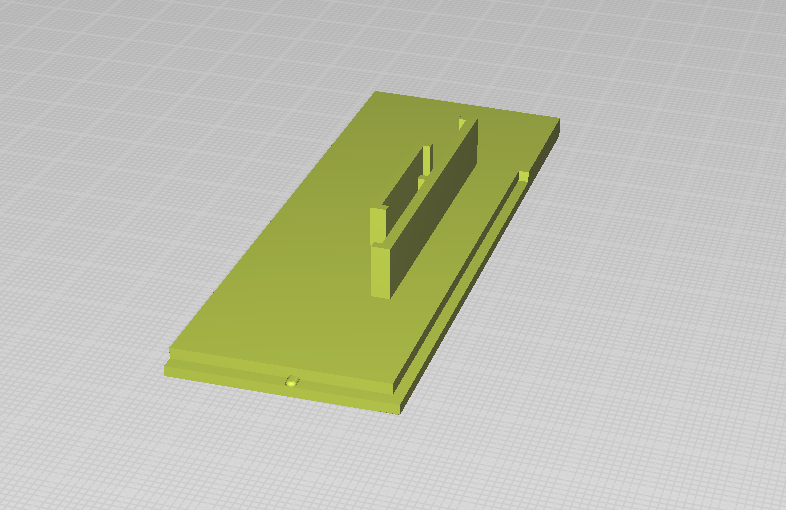
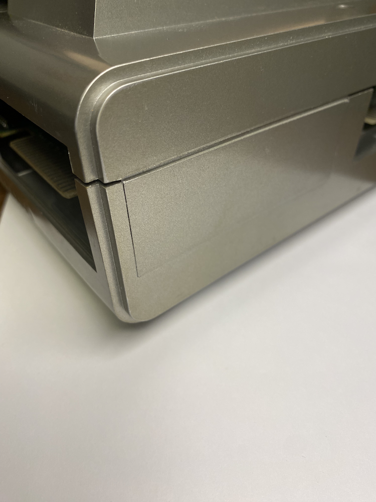
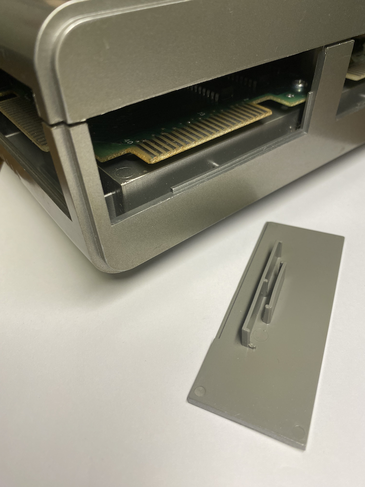
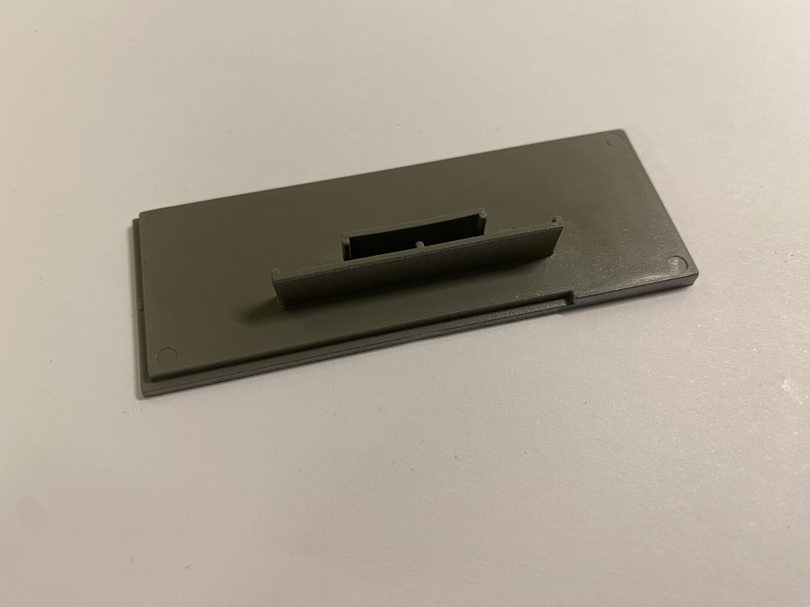
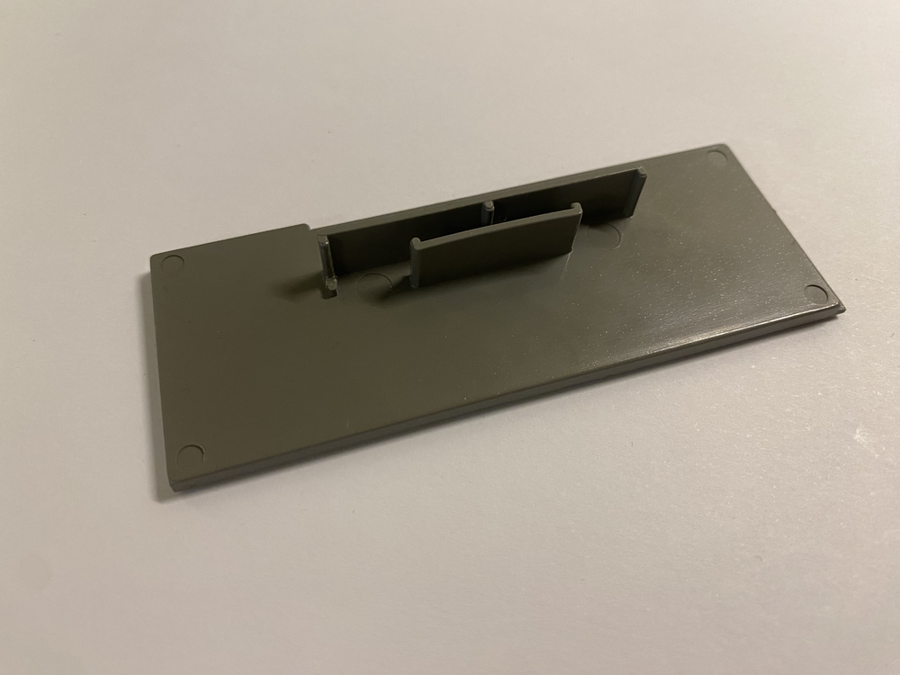

# TRS-80 Model 1 - Extension Interface Cover (Medium) - 3D Printer

These covers are for the Extension interface, covering up holes in the casing to block access to the edge-connectors and PCB. These covers are mostly cosmetic, but also protect the edge-connectors.

## STL

[STL](Extension_Interface_Cover_Medium.stl)

## 3D Printer-Friendly STL

[STL](Extension_Interface_Cover_Medium_Printable.stl)

### Print Instructions

- Lay the cover flat on the bed.
- No need for any support.

## Use Cases

### Profile

