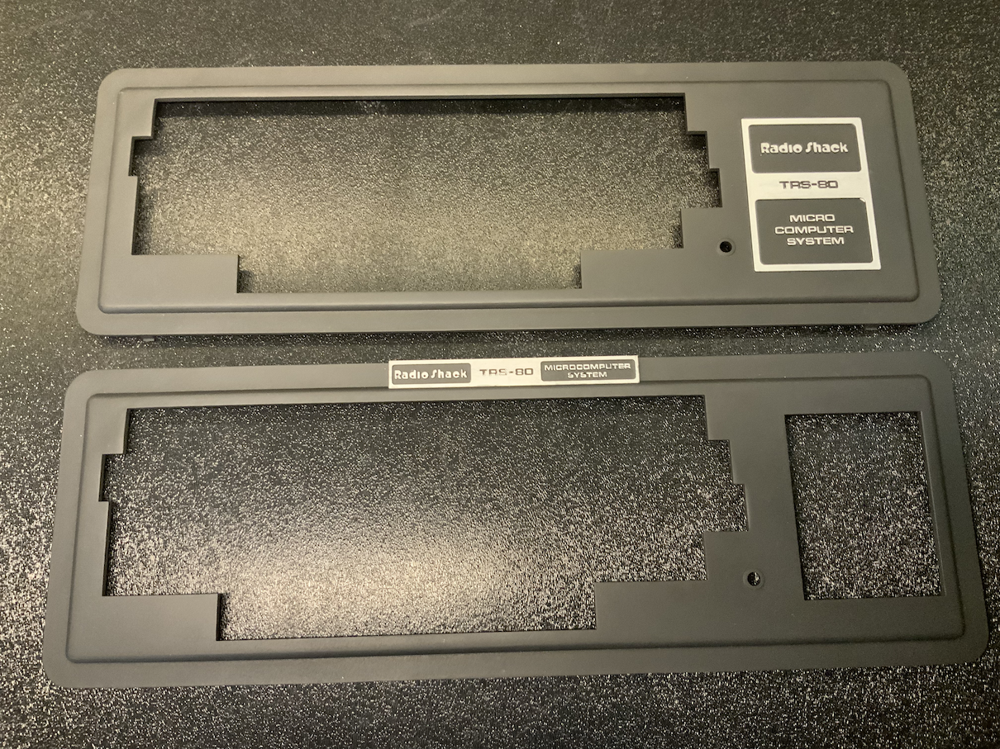
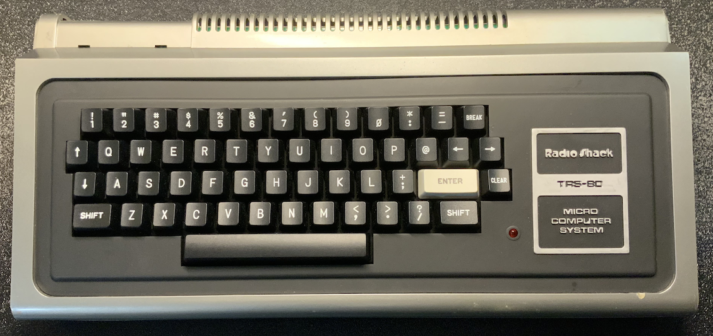

# TRS-80 Model 1 - Keyboard Bezel

The keyboard bezel covers the keyboard and closes up the case in the front.

## STL

Following designs are available in STL format:
- [Full keyboard with Numpad](Bezel_NumPad_Original.stl)
- [Keyboard without the Numpad](Bezel_Alpha_Original.stl)

## Order Instruction - [JLC3DP](https://www.jlcpcb.com) (service of JLCPCB)

You can print them yourself, but most likely you do not have such a large printer. You can order them online. What follows are instructions for JLC3DP, which I've had good experiences with. Additionally, they take care of sanding and finishing.

- Go to [JLC3DP](https://www.jlcpcb.com).
- Click the "Quote Now" button under the "3D Printing" image.
- Click the "Add 3D file" and select the STL file provided above.

A few options appear. In either case, I always selected "SLA(Resin)" for the technology, which has a very smooth surface.

For the bezel, I would choose the "Black Resin" option. It is a bit more expensive than the default, but it will reduce post-processing for you as you probably do not want a white bezel.

Leave all other options as-is.

You still have to select a "Product Description". Apparently, this is some customs requirement. I've selected for both "Office Appliances and Accessories" and "Keyboard Enclosure".

You can then hit "Save to Cart" and checkout.

By default, they will review your designs and send you an email to pay within a few hours. Simply go back to your order page (after you've created an account) and select "Pay".

NOTE: Most of the time, however, they will also send you an email to confirm that you want to assume the risk of ordering the design as-is as they are too long and may deform during production or have parts which are too thin. I've always accepted the risk and never had any trouble.

## Use Cases

