# TRS-80 Model 1 - Keyboard Button Placeholder - 3D Printer

The placeholder is used to guide the Enter key straight down as the ALPS key is located on the other side of the 2x size key. Without it, the key will create too much strain on the Enter-key stem and break it.

See the assembly instructions below.

## STL

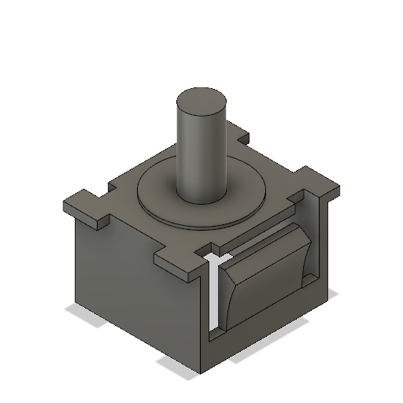
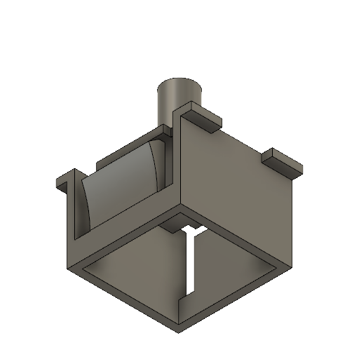

[STL](Keyboard_Button_Placeholder.stl)

## 3D Printer-Friendly STL

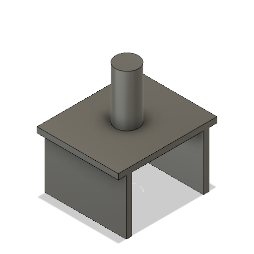
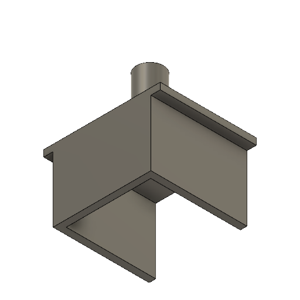

[STL](Keyboard_Button_Placeholder_Printable.stl)

### Print Instructions

- Lay the item on its side with the closed side of the box on the bed. The opening should be towards the top.
- Add support for the pin. This support will need to be removed afterward for it to function properly.

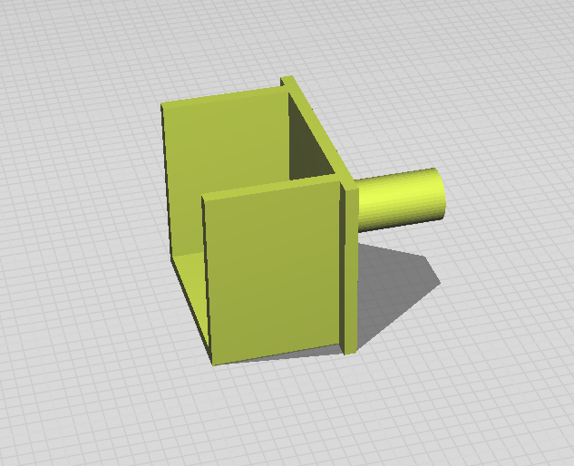

**NOTE**: The real item has also clips, but it isn't necessary as the stem will keep this item in place.

## Use Cases

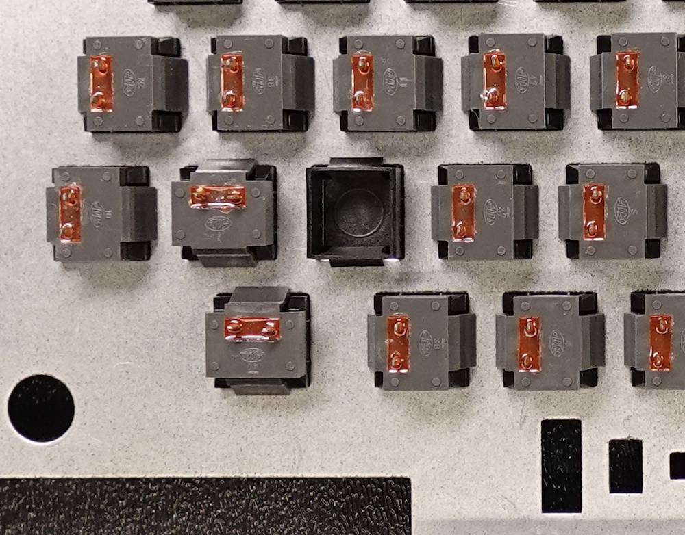
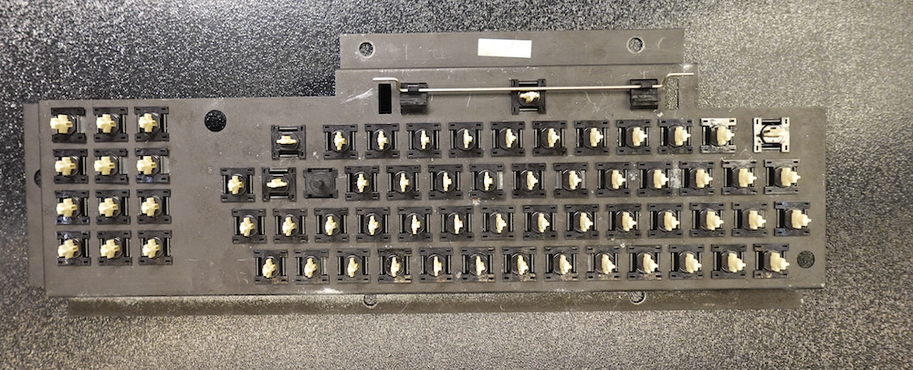

### Profile

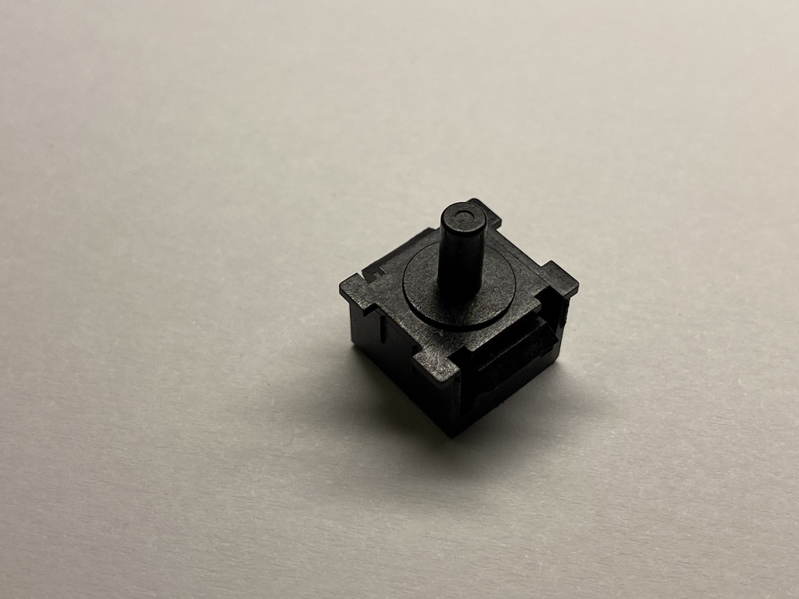
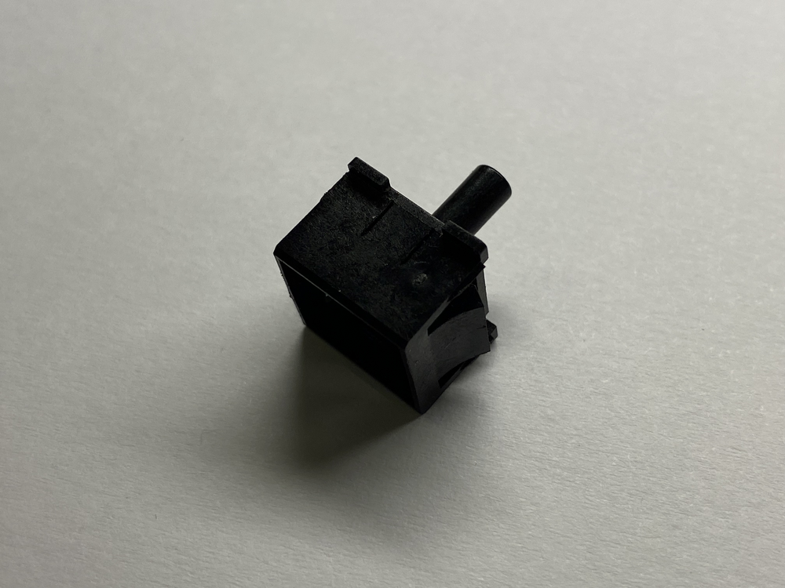
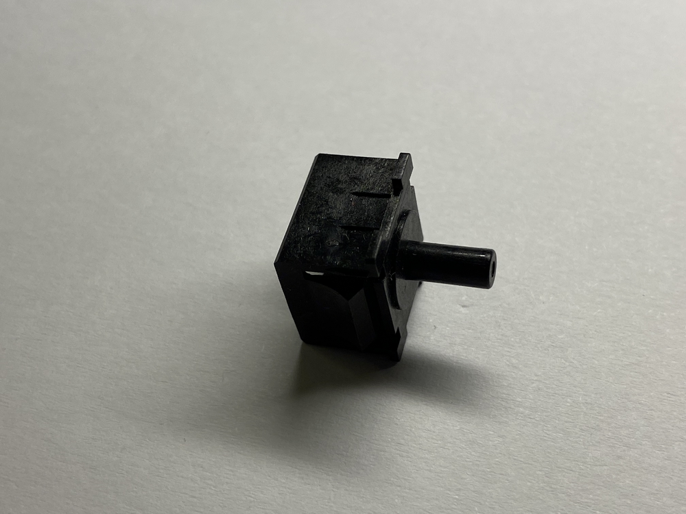
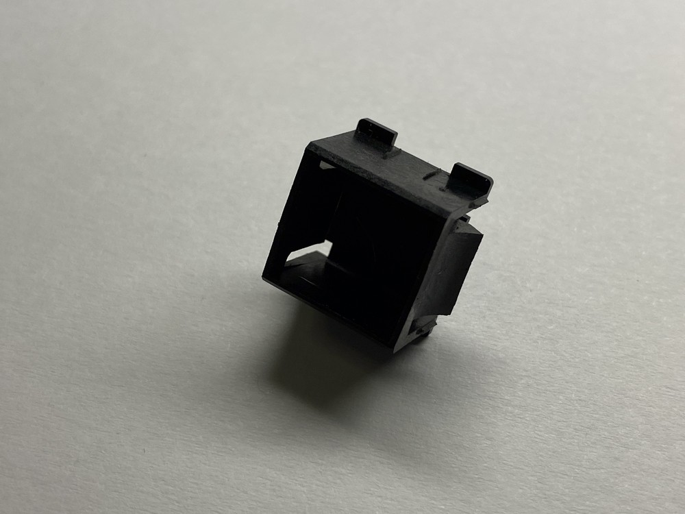

### Assembly

Location on the keyboard:

Notice that the Enter Keycap has one side the has a round hole.

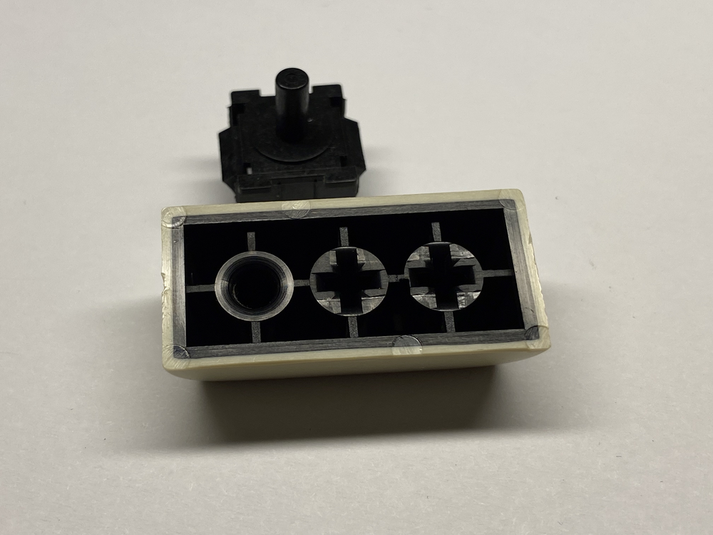

The other side of the keycap will house the cross stem.

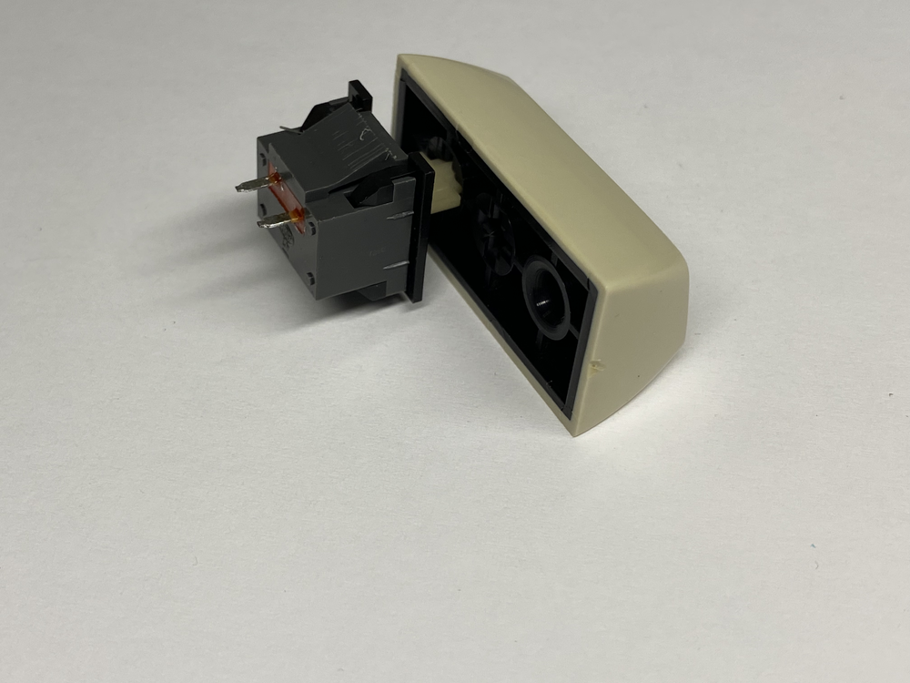

With both fitted, it will look like the following. This is ony to demonstrate where each goes. Don't assemble already.

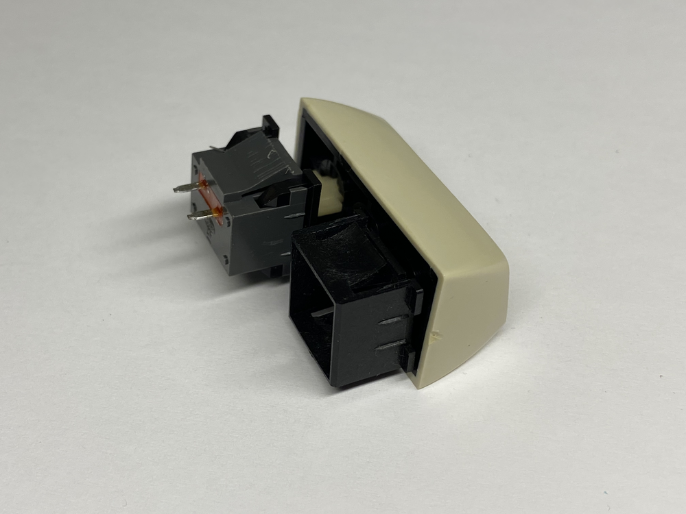
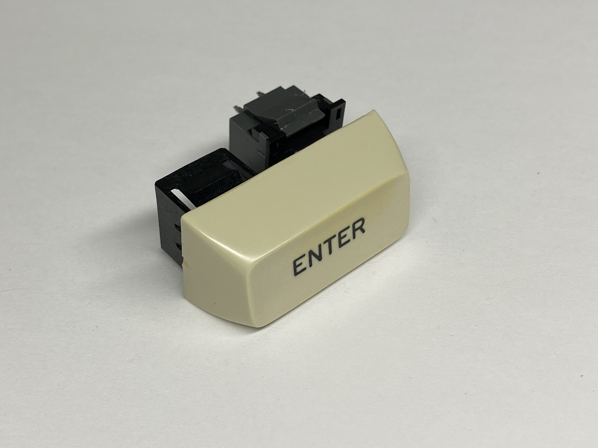

When the item is put into the shield, you can simply clip the keycap on top of it. This only works if the ALPS key is oriented correctly (see above image).

