# TRS-80 Model 1 - Keyboard Clip - 3D Printer

The clip is attached to the keyboard shield and holds the spacebar rod fixed to the keyboard shield. This is the counter part to the Keyboard Spacebar clips.

See the assembly and disassembly instructions below.

If you are missing the spacebar rod, then please check the instructions on how to create a new one in the Keyboard Spacebar clips page.

## STL

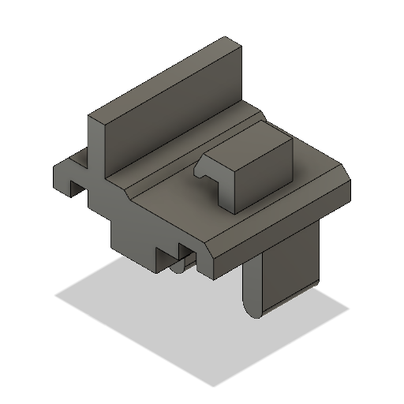
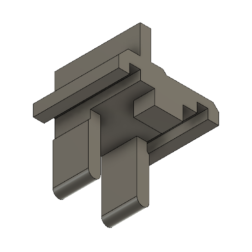

[STL](Keyboard_Clip.stl)

## 3D Printer-Friendly STL

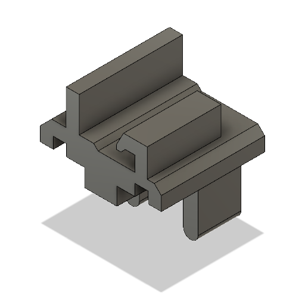
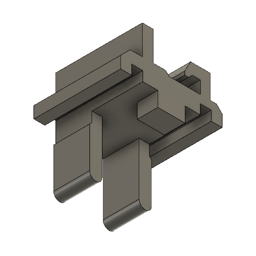

[STL](Keyboard_Clip_Printable.stl)

### Print Instructions

- Lay the item on its side where the clip touches the bed. The two flaps should be on the top.
- Add support for the two flaps. This support will need to be removed afterwards to make sure the clip fits in the holes.

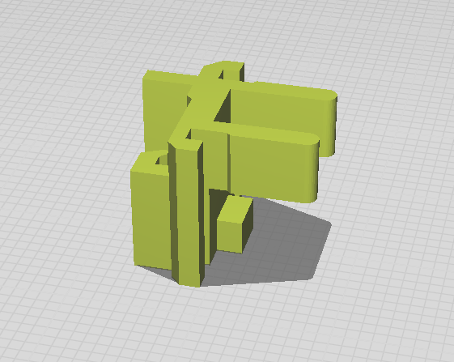

## Use Cases

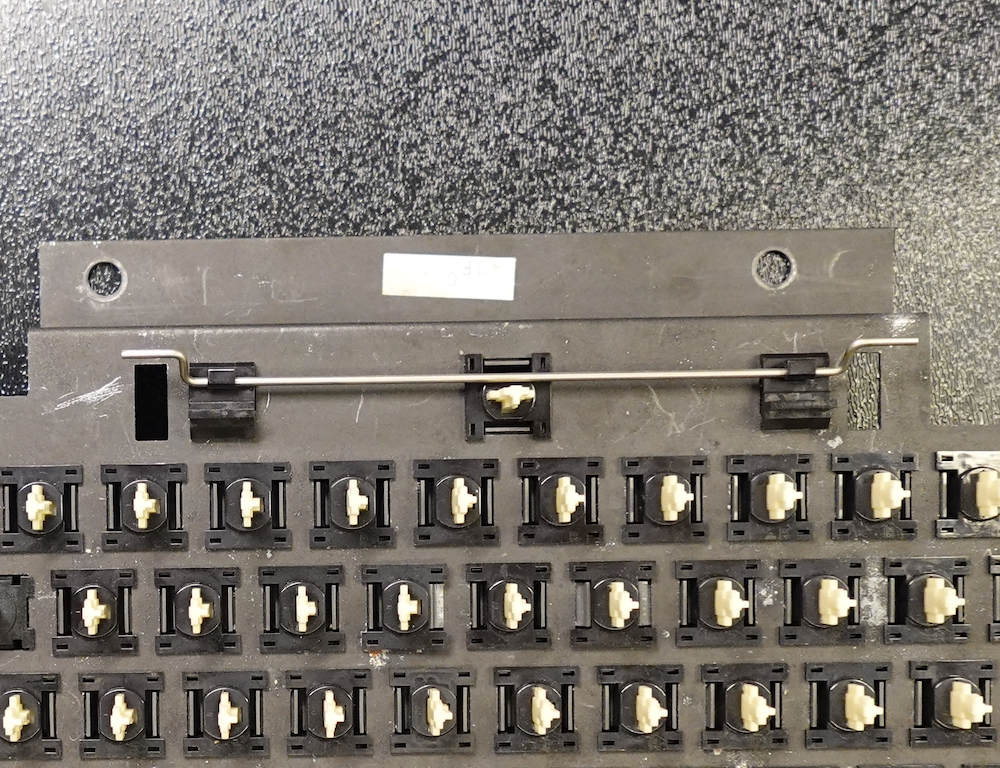

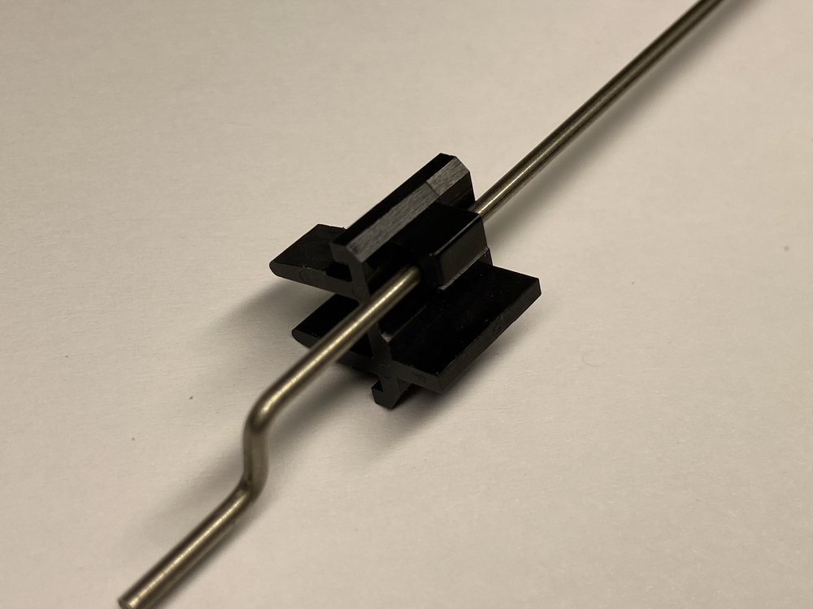
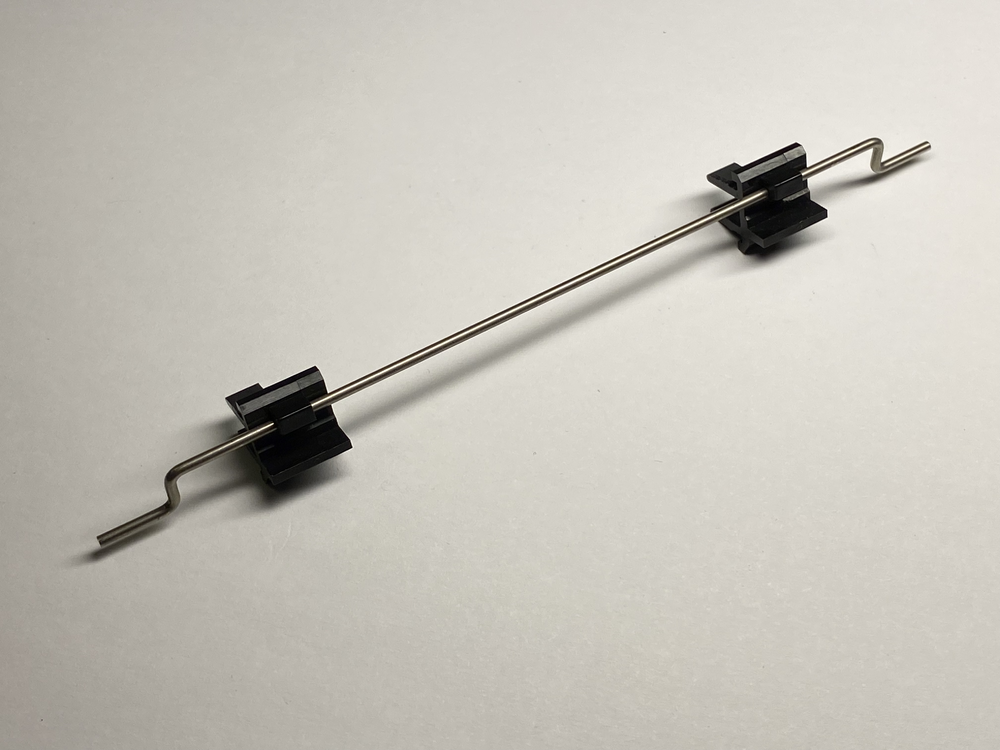

### Profile

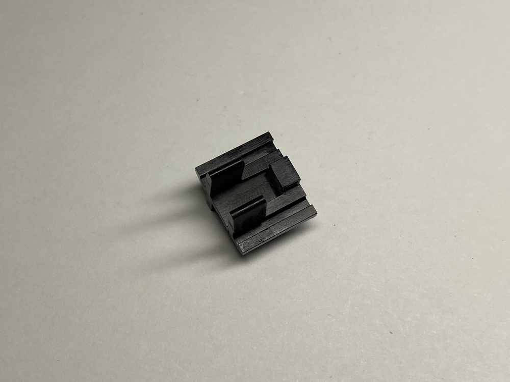
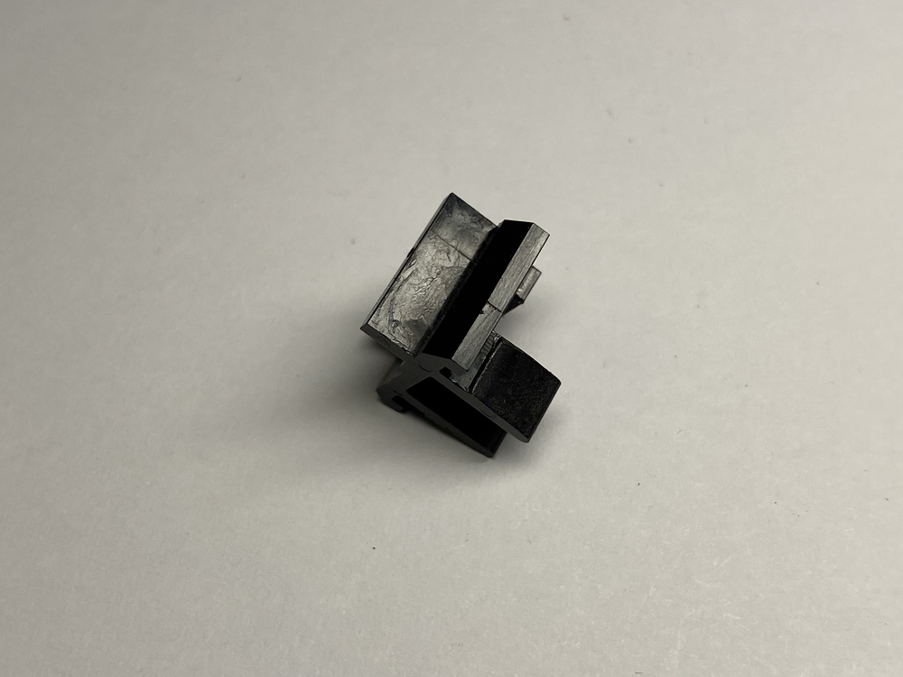
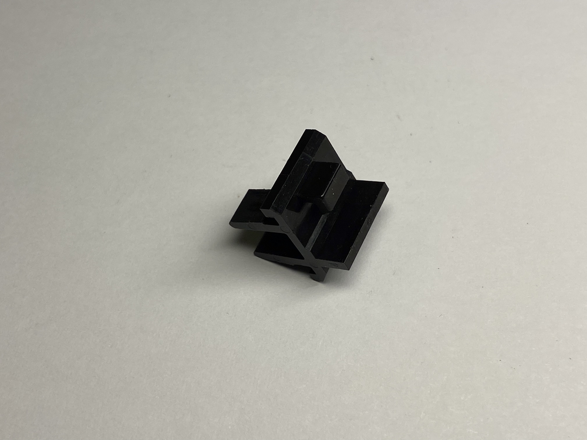
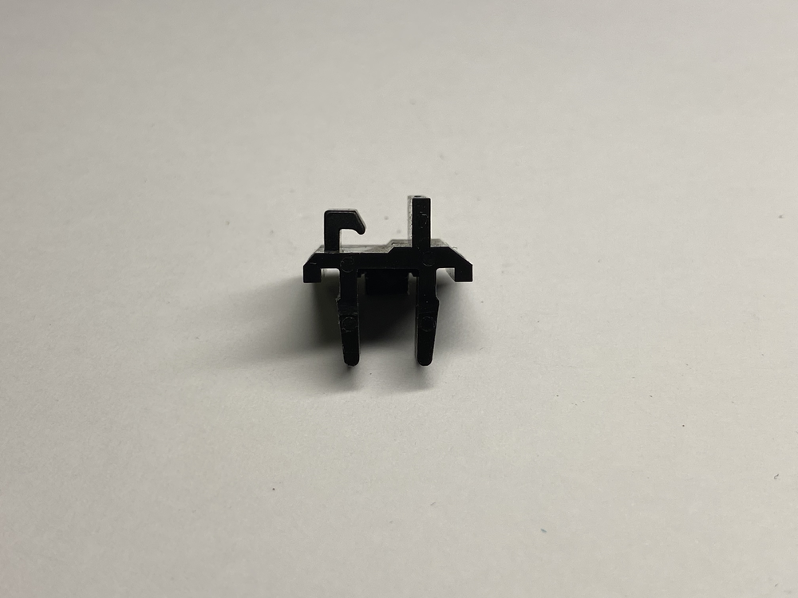

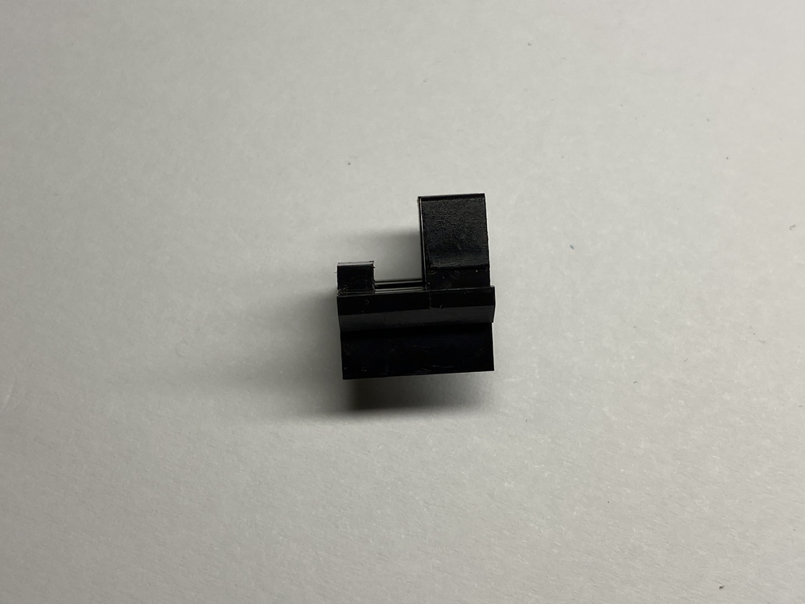

### Assembled

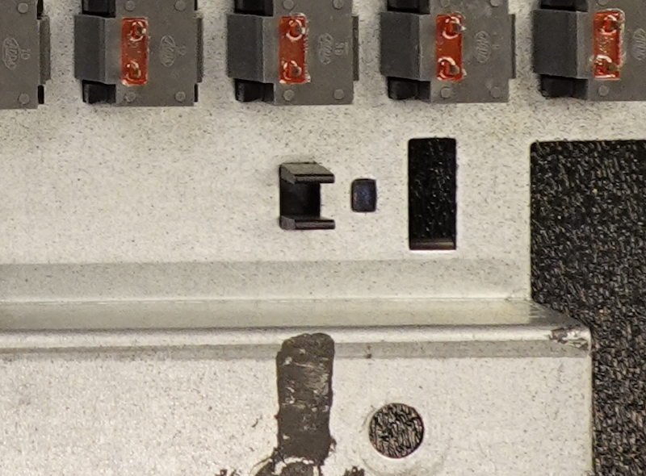

### Disassembly

Simply press the two flaps together and push it out. You can also use something small (round-ish) to push against the square plastic tab.

### Assembly

- Feed the item from the top into the keyboard shield. Both go in the same orientation on either side of the keyboard spacebar.
- Make sure the square tab is oriented with the hole.
- Keep pushing in until the two flabs click in place.

**NOTE**: The square tab is there to ensure orientation. Make sure to lower it straight down.
