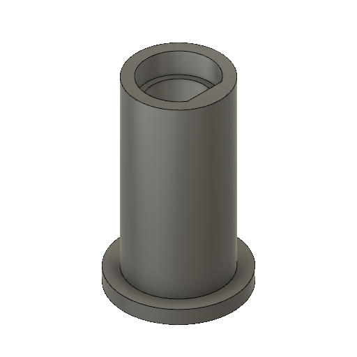
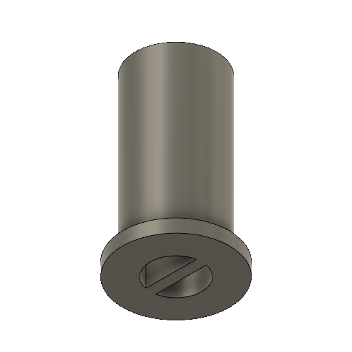
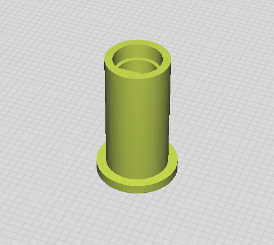
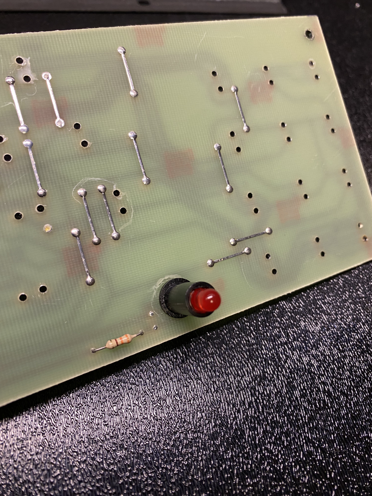
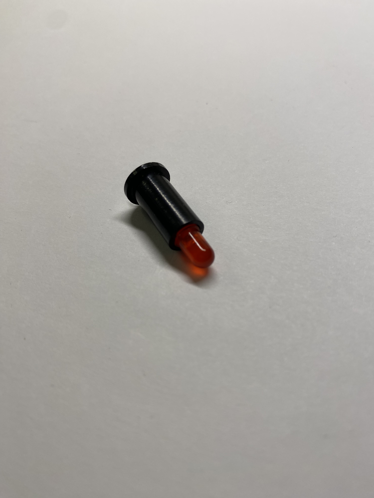
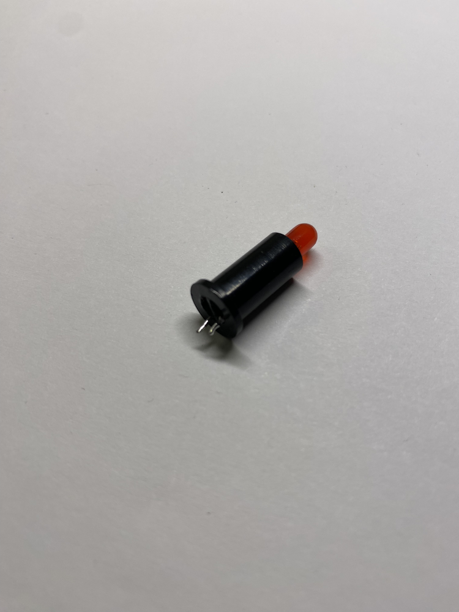
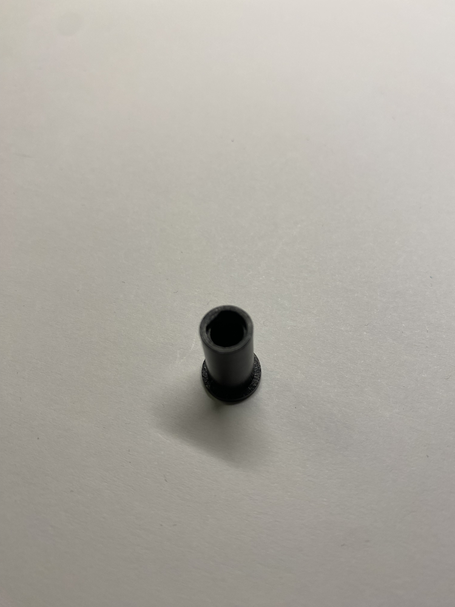

# TRS-80 Model 1 - Keyboard LED Stand-Off - 3D Printer

The LED Stand-off gives rigidity to the LED on the keyboard PCB. It also makes sure that the LED easily fits into the casing hole at the keyboard.

See the assembly instructions below.

## STL

[STL](Keyboard_LED_Standoff.stl)

### Print Instructions

Stand the item up with the wide side at the bottom. In the center, there is a small separater for the LED legs and therefore the items needs to be printed in that orientation.

## Use Cases
ß

### Profile

### Assembly

**NOTE**: Use a 5mm LED!

1. The top hole has one side with a straight edge. That is where the flat side of the LED head sits. The round parts should snugly fit into the hole and rest on the ring inside.
2. When pushing the LED all the way through, make sure the legs are separated into each side of the split in the tube.
