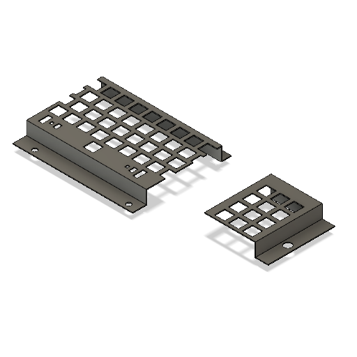
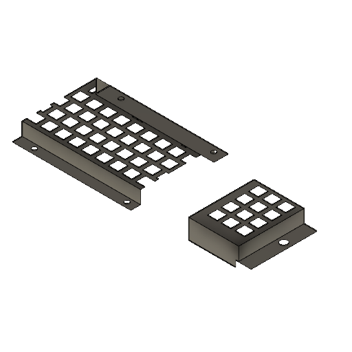
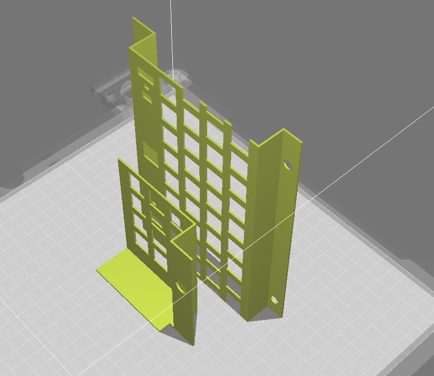

# TRS-80 Model 1 - Keyboard Stem (for ALPS Keyboard) - 3D Printer

The stem transfers the force from a finger press on the keycap to the spring and simultaneously presses the metal flap inside the button, creating the contact needed for the button press to be recognized. These components easily break and often require replacement.

## STL

[STL](Keyboard_Stem_ALPS.stl)

## 3D Printer-Friendly STL

The original STL is broken down into two STLs to simplify printing on smaller printers (min. 165x136.1x18.3mm).

[Keyboard STL](Keyboard_Shield_Printable_Main.stl)
[Number Pad STL](Keyboard_Shield_Printable_Num.stl)

### Print Instructions

- Print both items vertically.
  - The number pad should stand on the flat side. This flat side is a bit longer than the other one as it will add required distace to the keyboard PCB. This is not on the original part, but because of splitting the STL, there is no spacer available and there is another way required to add spacing to the PCB to keep it upright when assembled.
  - The main part of the keyboard should stand flat on either side of the board. Parts of it is cut-off because it would require a pretty wide printer. However, this shield will add regidity to the central part of the keyboard - the most used parts. The sides will already be largerly supported by the PCB itself and the spacers below the keyboard PCB.
- Add support for for the keycap holes. This support will need to be removed afterward to fit the buttons in.

## Use Cases

### Assembled

