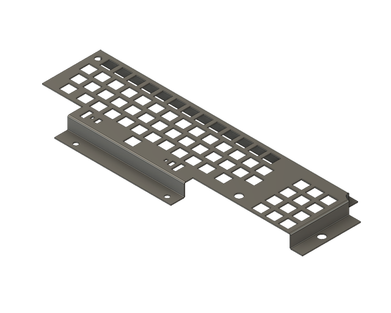
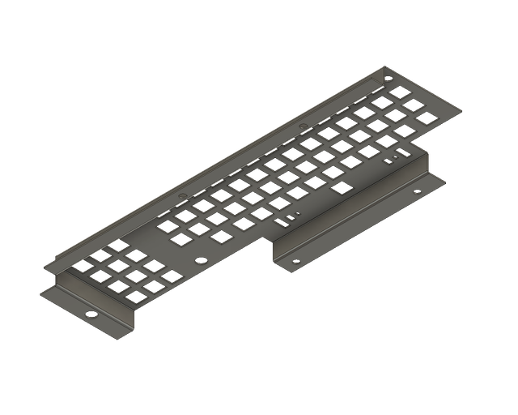
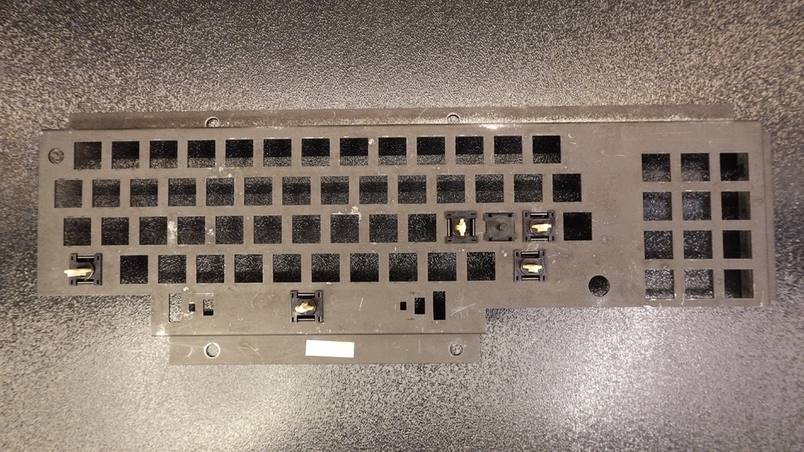
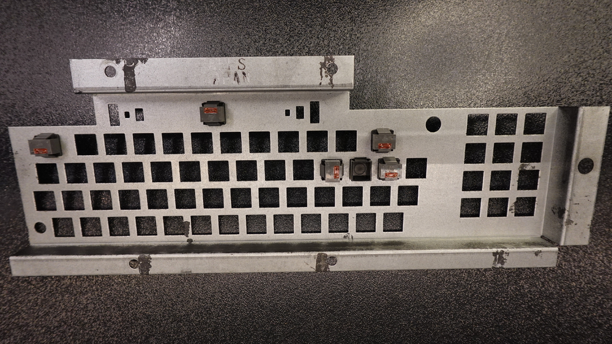
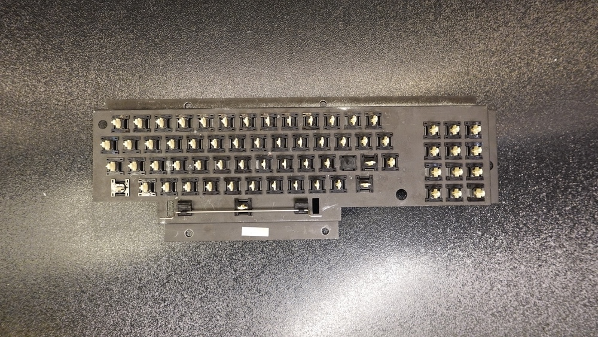
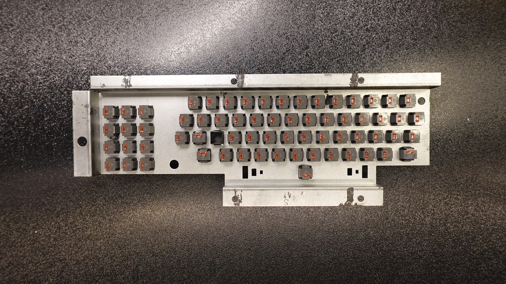

# TRS-80 Model 1 - Keyboard Shield (for ALPS Keyboard)

The keyboard shield has a few functions:

- Protects the keyboard PCB and mainboard PCB from external factors.
- Keeps the keycaps at a specified place and distance to the case.
- Separates the keyboard PCB from the main PCB

## STEP

This is a sheet metal version of the keyboard shield replica. You can use the STEP file to submit it to online sheet metal fabs like SendCutSend, Fabworks, or PCBWay.

[STEP](Keyboard_Shield_ALPS_v2.step)

Configuration:

- Suggested Material: Steel G90 (SendCutSend), Steel 1008 (Fabworks)
- Thickness: 1.22mm (0.048")
- K Factor: 0.46
- Bend Radius: 0.762
- Finish: Matte Black

## Use Cases

### Assembled

