# TRS-80 Model 1 - Keyboard Spacebar Clip - 3D Printer

The spacebar clip holds the small metal bar in place to ensure consistent pressure on the button across the spacebar keycap. It also helps to reduce pivoting, thereby decreasing the overall stress on the keycap pin. 

See the assembly instructions below.

Unfortunately, the metal rod is easily lost. Below is also a description of how to recreate the metal rod.

## STL

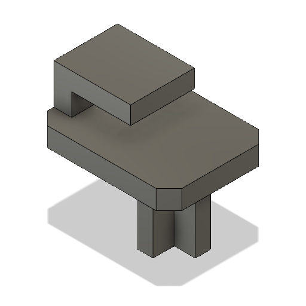
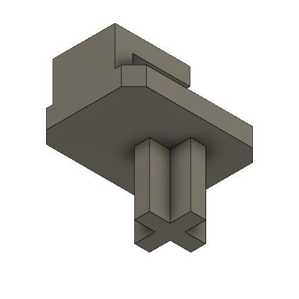

[STL](Keyboard_Spacebar_Clip.stl)

### Print Instructions

- Lay the clip on either of its longer sides.
- Add support for the cross pin and the clip. The support at the cross pin will need to be removed afterward.

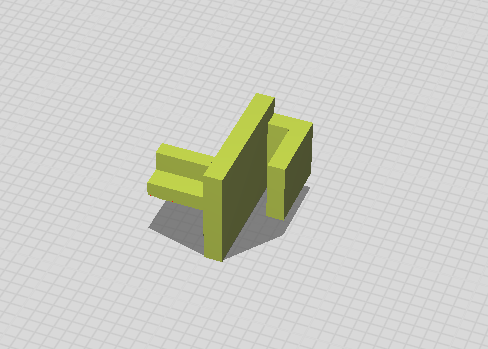

## Use Cases

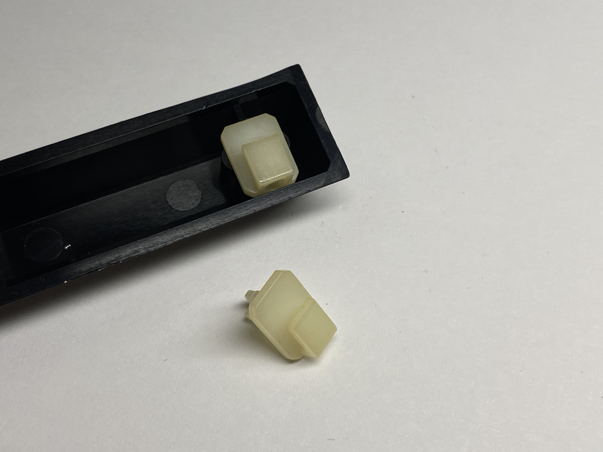

### Profile 

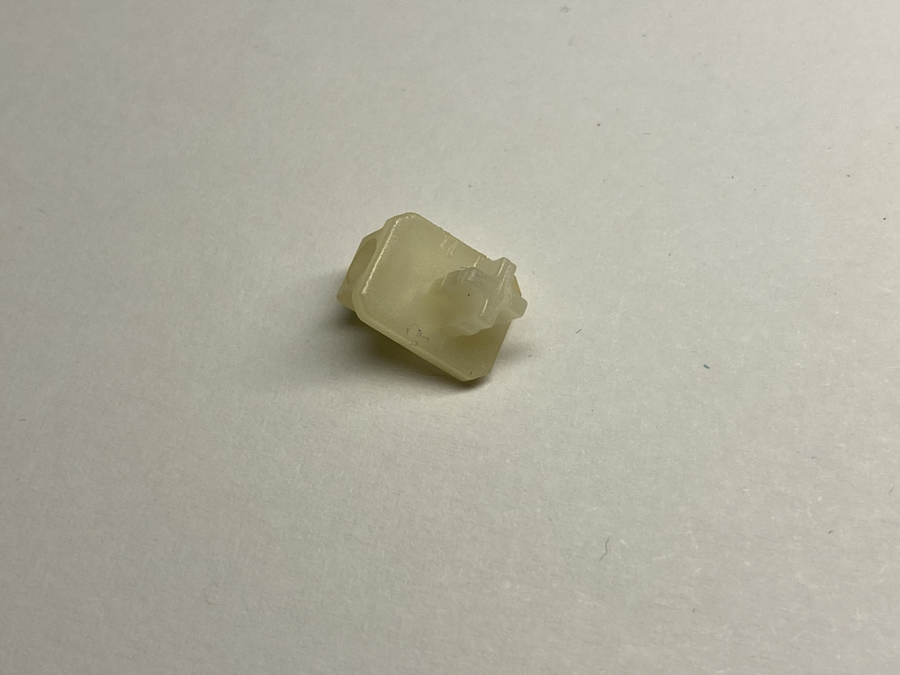
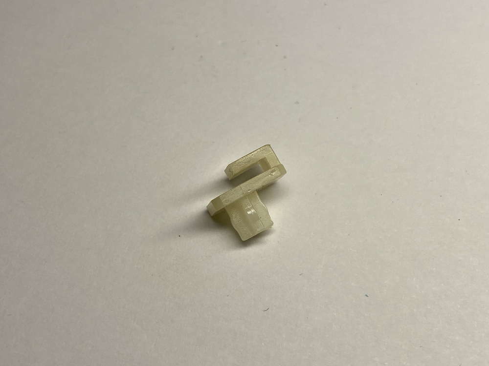
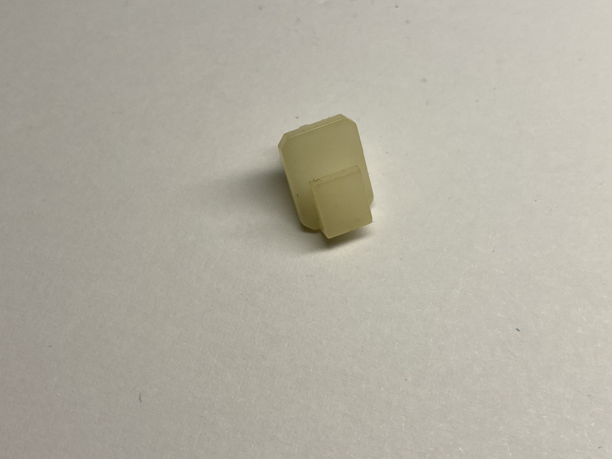
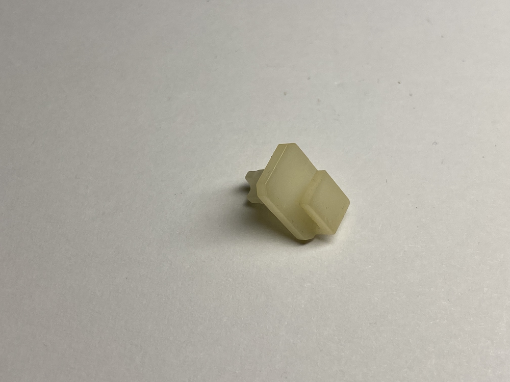

### Assembled

### Assembly

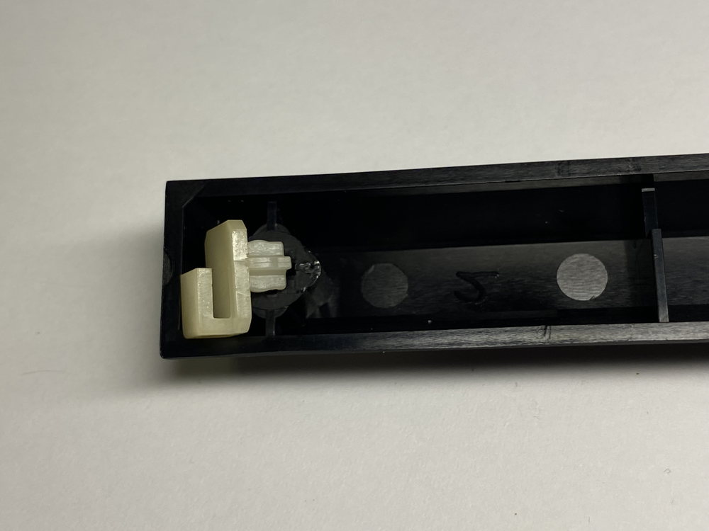

1. Insert the cross pin on the back into either side of the spacebar keycap. Ensure you position the clip towards the top of the spacebar keycap, as the keycap is more slanted at the top than at the bottom.

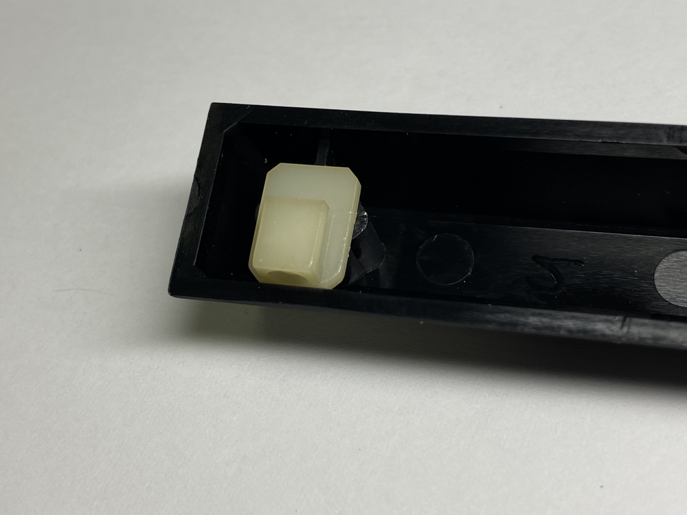

2. Press firmly on the largest flat areas of the clip on either side. Do not press on the clip itself, as it may crack from the pressure.

## Metal Rod

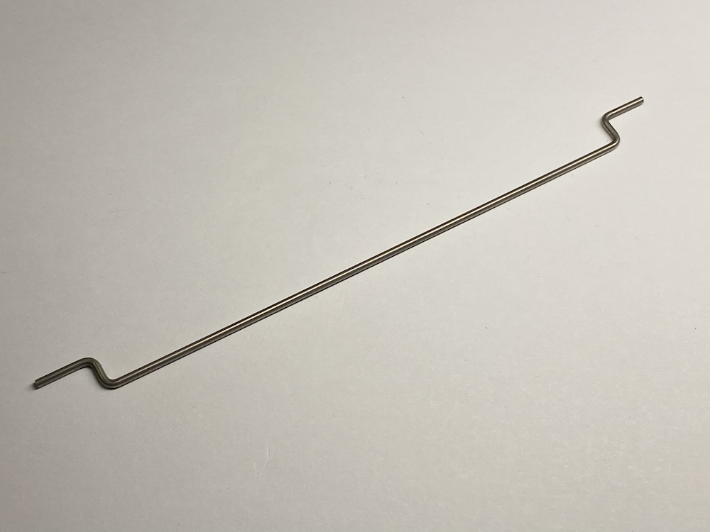

1. Cut a 1.6 mm rod to a length of 160 mm.
2. Bend one end of the rod 90 degrees at a distance of about 12 mm from one end, in any direction.
3. Bend the next 90 degrees back in the same direction the rod was originally heading, at a distance of about 8 mm.
4. Repeat steps 2 and 3 for the other side as well, but make sure the rod stays flat overall. The central part of the metal rod will have a length of about 120 mm.

**Note**: Ensure that the metal rod lies somewhat flat when placed on a table. You can twist the bends slightly to correct their direction, making them flat.