# TRS-80 Model 1 - Keyboard Stem (for ALPS Keyboard) - 3D Printer

The stem transfers the force from a finger press on the keycap to the spring and simultaneously presses the metal flap inside the button, creating the contact needed for the button press to be recognized. These components easily break and often require replacement.

See the assembly and disassembly instructions below.

## STL

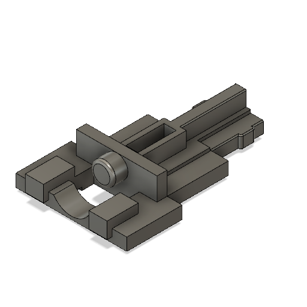
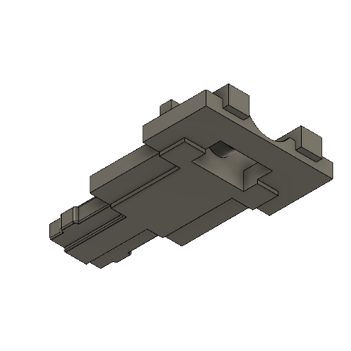

[STL](Keyboard_Stem_ALPS.stl)

## 3D Printer-Friendly STL

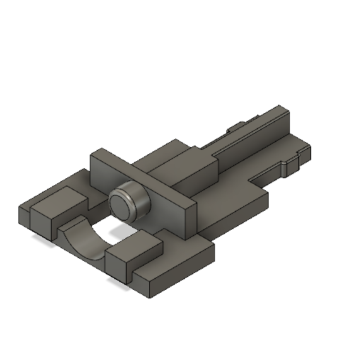
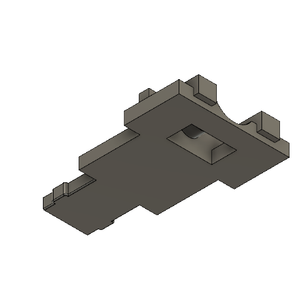

[STL](Keyboard_Stem_ALPS_Printable.stl)

### Print Instructions

- Lay the stem flat on the bed, ensuring the very flat side is at the bottom.
- Add support for the small pin for the spring. This support will need to be removed afterward for it to function properly.

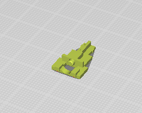

## Use Cases

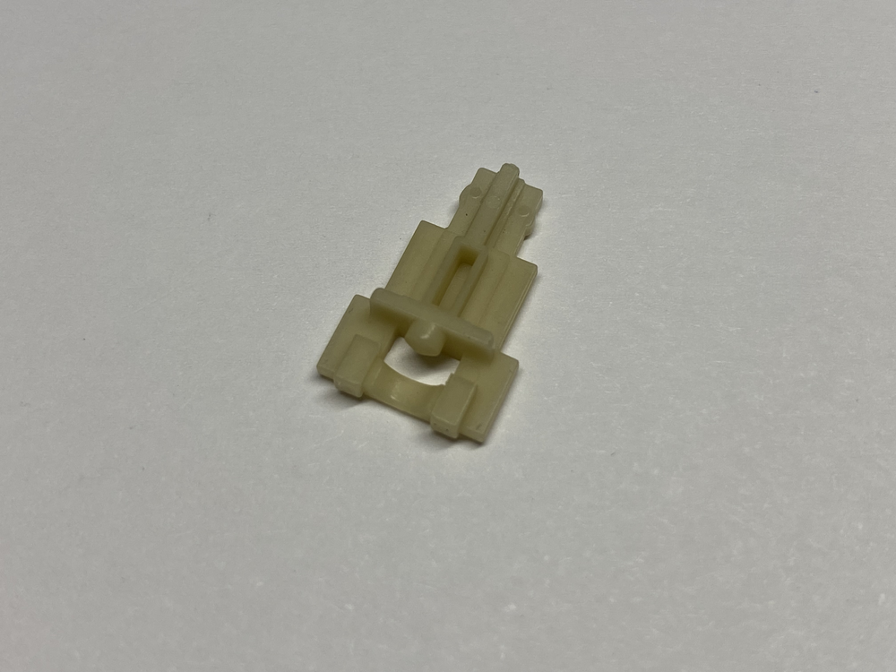
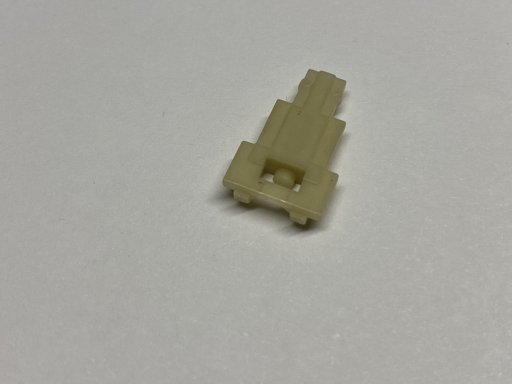

### Assembled

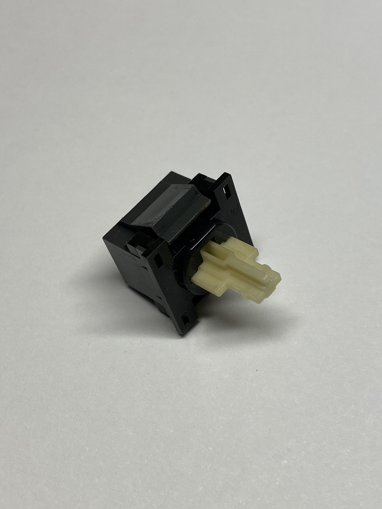
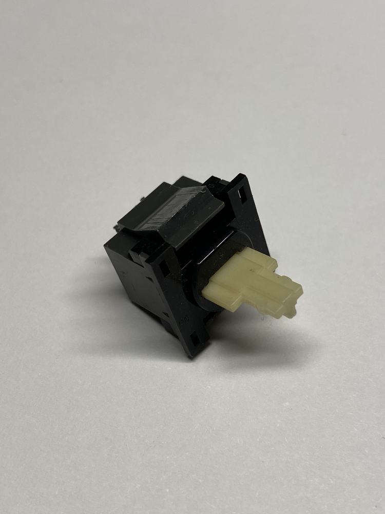
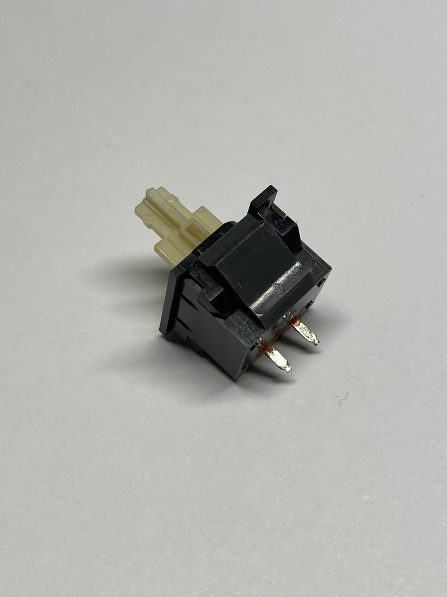

### Disassembled

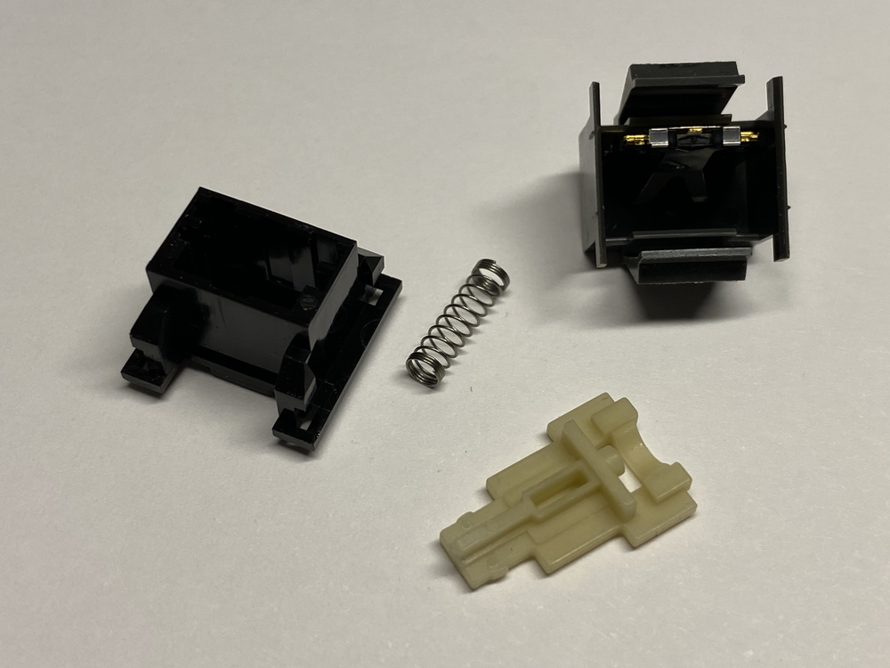

### Disassembly

1. Use something thin and long that can go between the plastic flaps on each side of the casing. In this case, I've used an electronics tweezer. 

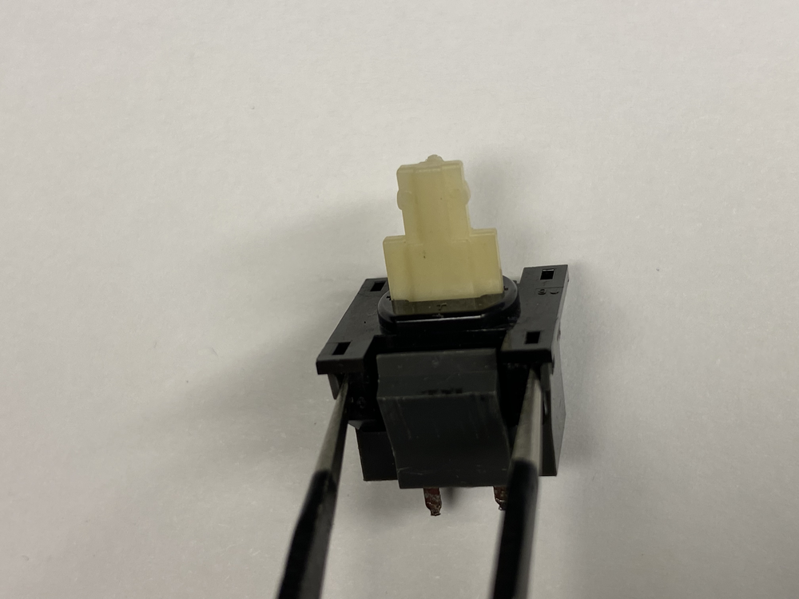
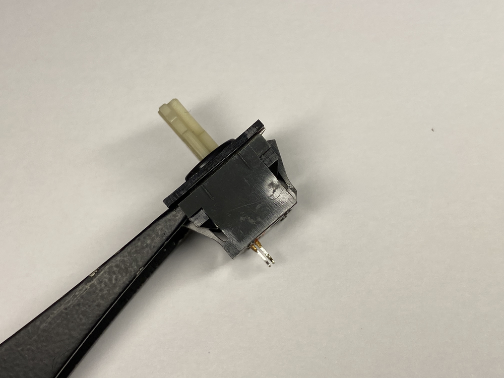

2. Push further in to spread the plastic flaps away from the bottom part of the case.

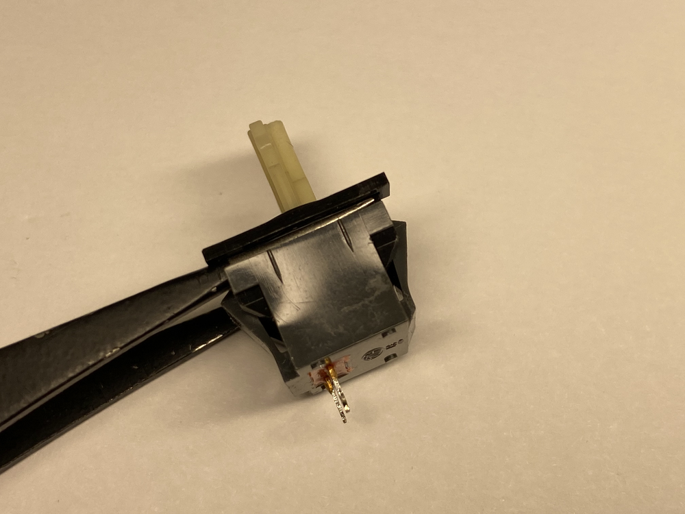

3. Pull up on the top part of the case, separating the parts and freeing the stem. Be careful not to lose the spring, as it may shoot out during the process.

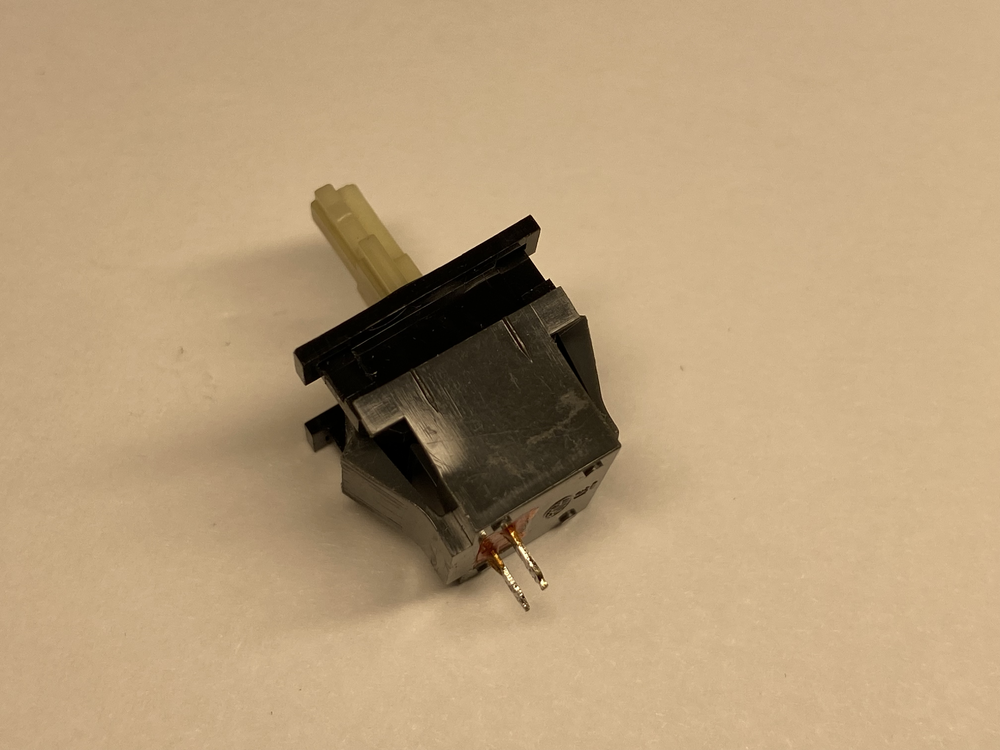

### Assembly

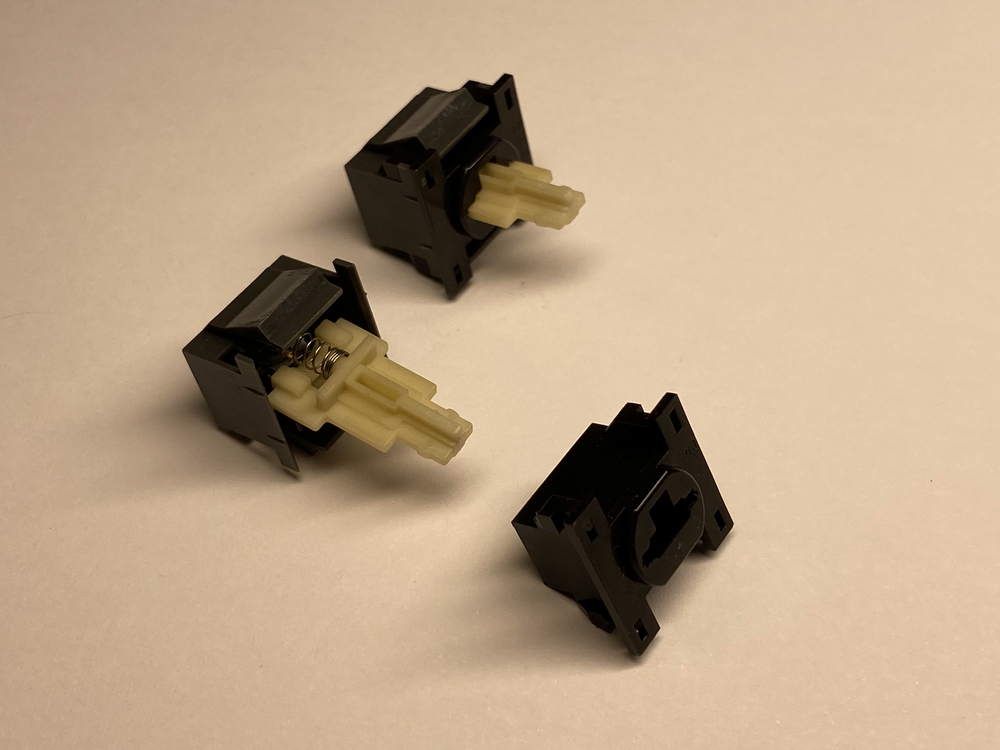

1. Insert the spring into the casing.
2. Pivot the casing forward so that the spring leans against the front of the casing.
3. Add the stem with the "pin" side down. The spring should be around the pin. Do not press down on the spring, as the stem will shoot out again as soon as you let go. Simply rest it on the spring.

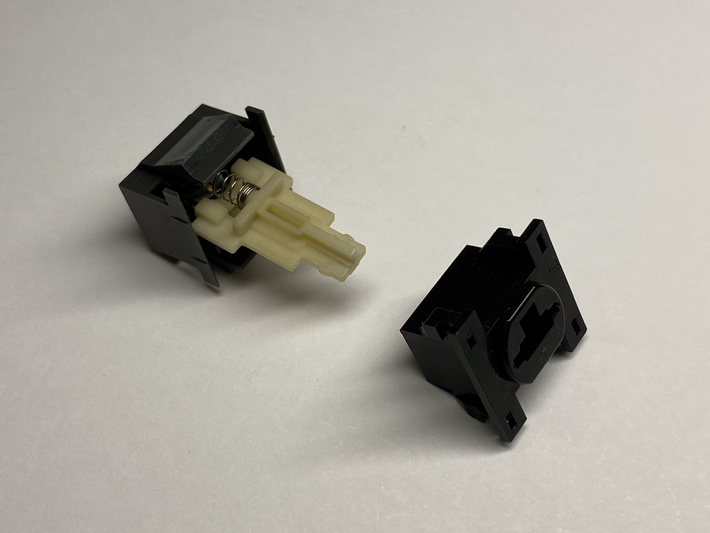

4. Get the top part of the cover. Make sure to orient the T-hole as shown.
5. Fit the stem through the hole and gently press together until the flaps click in.

## Changelog

### 21st Jan 2024

- Thinning of stem: needed filing to not get stuck