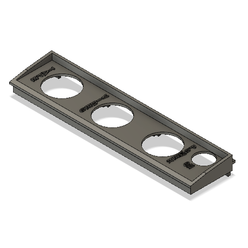
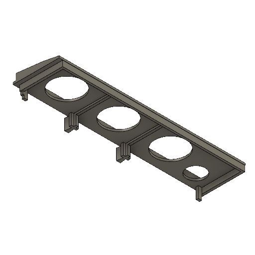
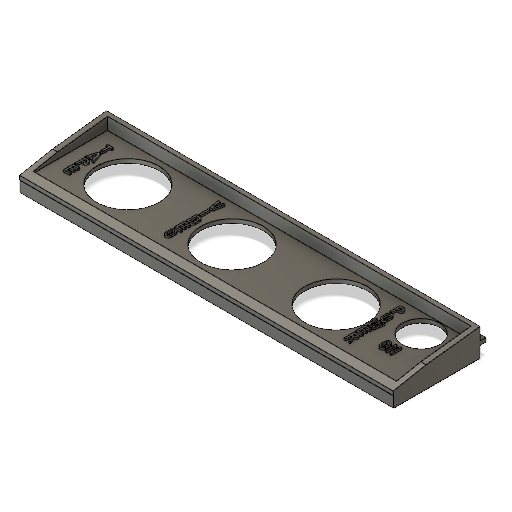
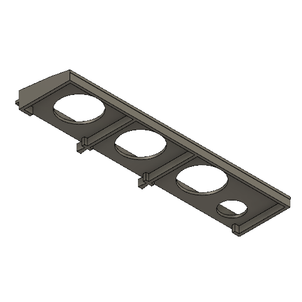
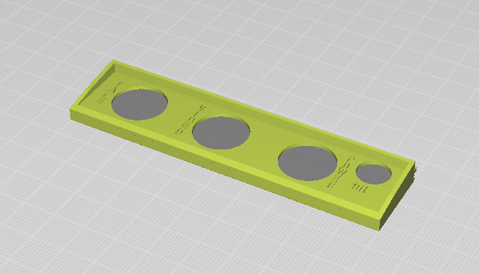
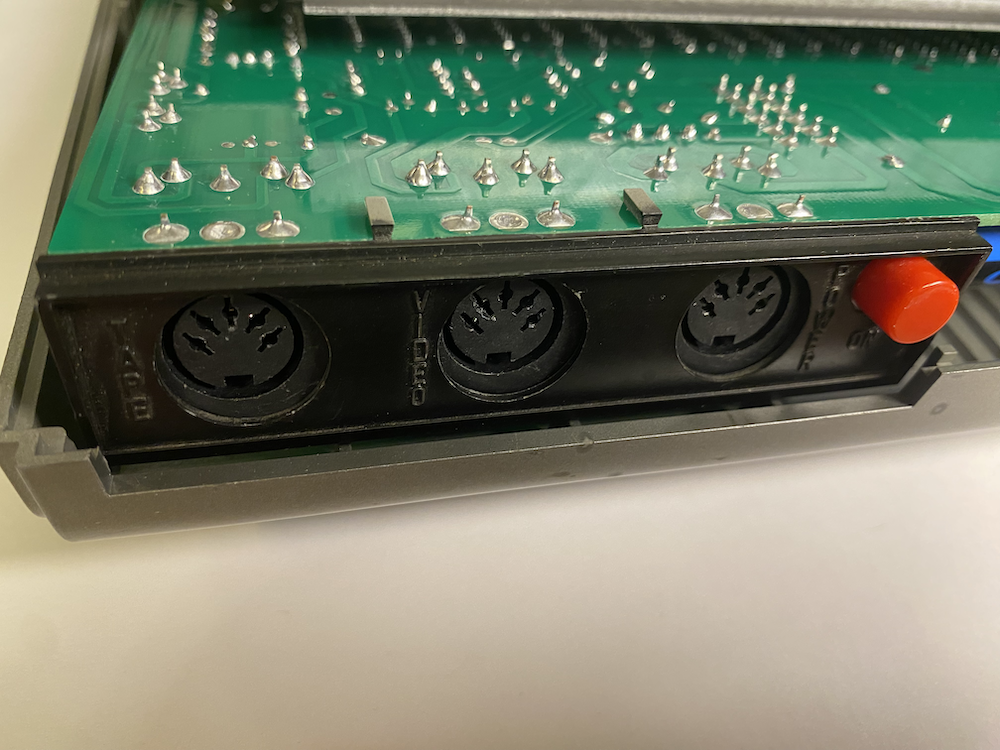
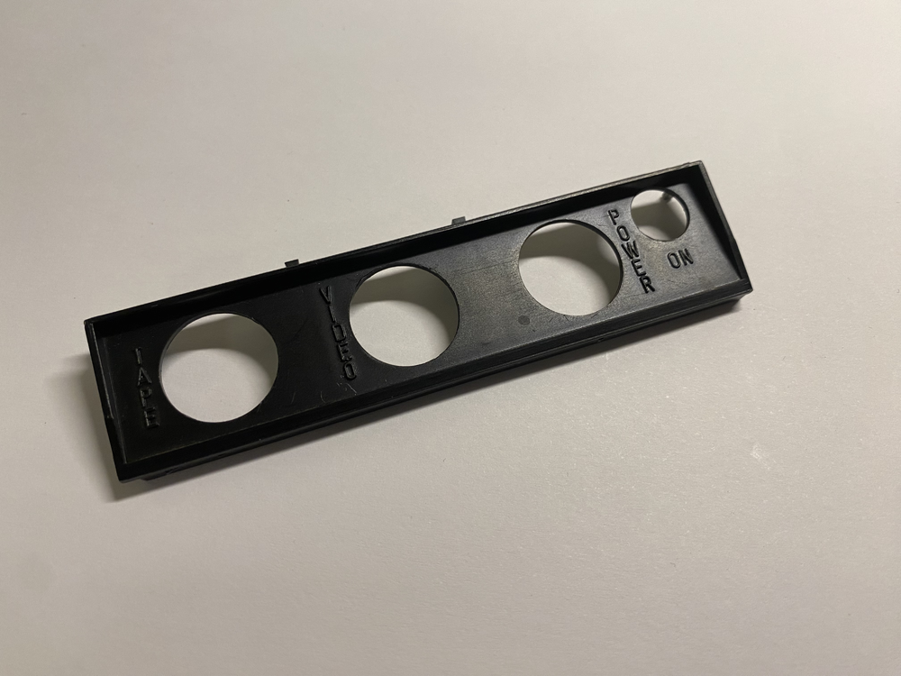
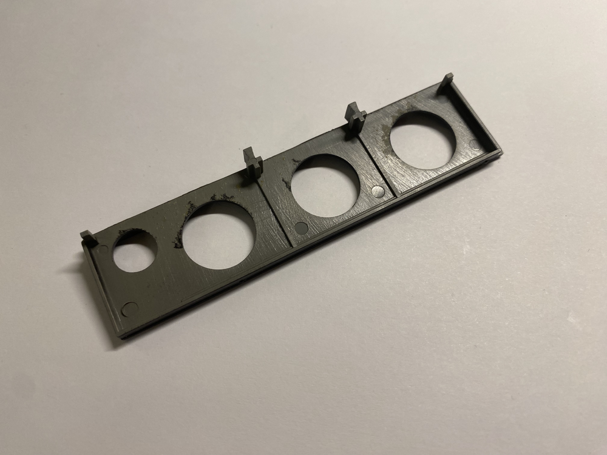

# TRS-80 Model 1 - Main Enclosure Panel - 3D Printer

The Main Enclosure Panel is used to cover an opening at the back of the computer, protecting the main PCB. It also provides access holes and labels for power, video, and tape interfaces, as well as a hole for the power button.

## STL

[STL](Main_Enclosure_Panel.stl)

## 3D Printer-Friendly STL

[STL](Main_Enclosure_Panel_Printable.stl)

### Print Instructions

- Lay the panel flat on the bed, label-side up.
- Add support at the bottom.

**Note**: The writing is very thin, and many printers may not be able to print it!

## Use Cases

