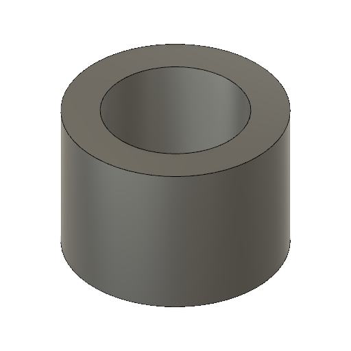
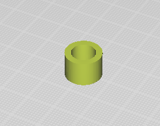
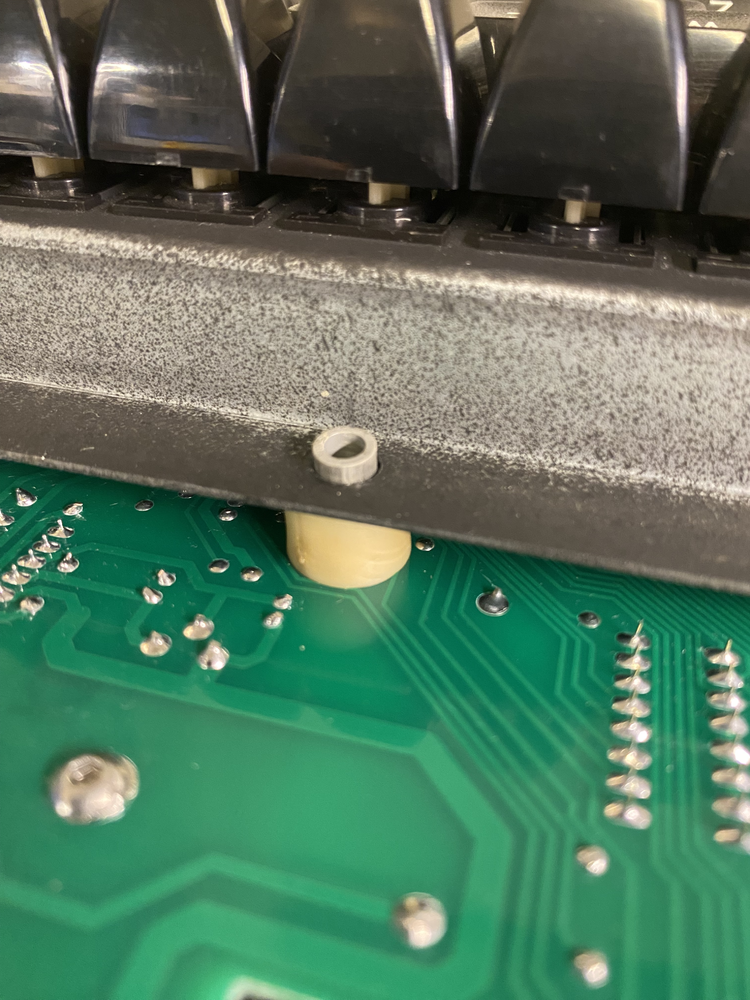
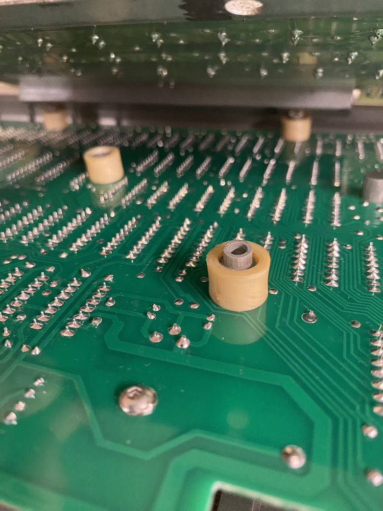
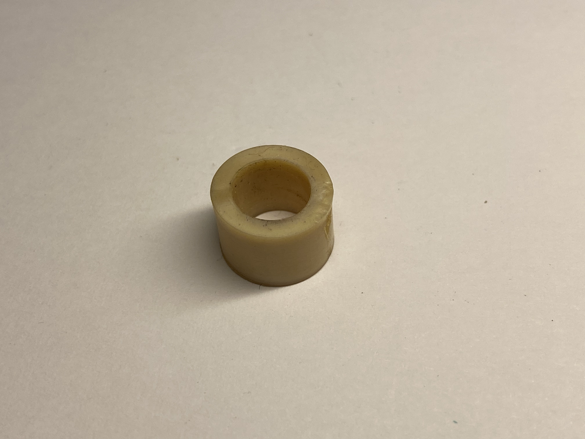

# TRS-80 Model 1 - PCB Stand-off - 3D Printer

The PCB standoff is being used to separate the keyboard from the mainboard to avoid electronic connectivity. Additionally, since it is made of gummy like material, it buffers each keystroke on the keyboard a bit, reducing the stress on the mainboard.

## STL

[STL](PCB_Standoff.stl)

## Print Instructions

Print the item with either flat side down. This ensures that the standoff is round, although this isn't strictly necessary.

Make sure you use a flexible filament, such as NinjaFlex or another type of TPU. The flexibility is necessary for dampening each keystroke. Printing it in plastic might actually end up damaging the main PCB board.

## Use Cases

